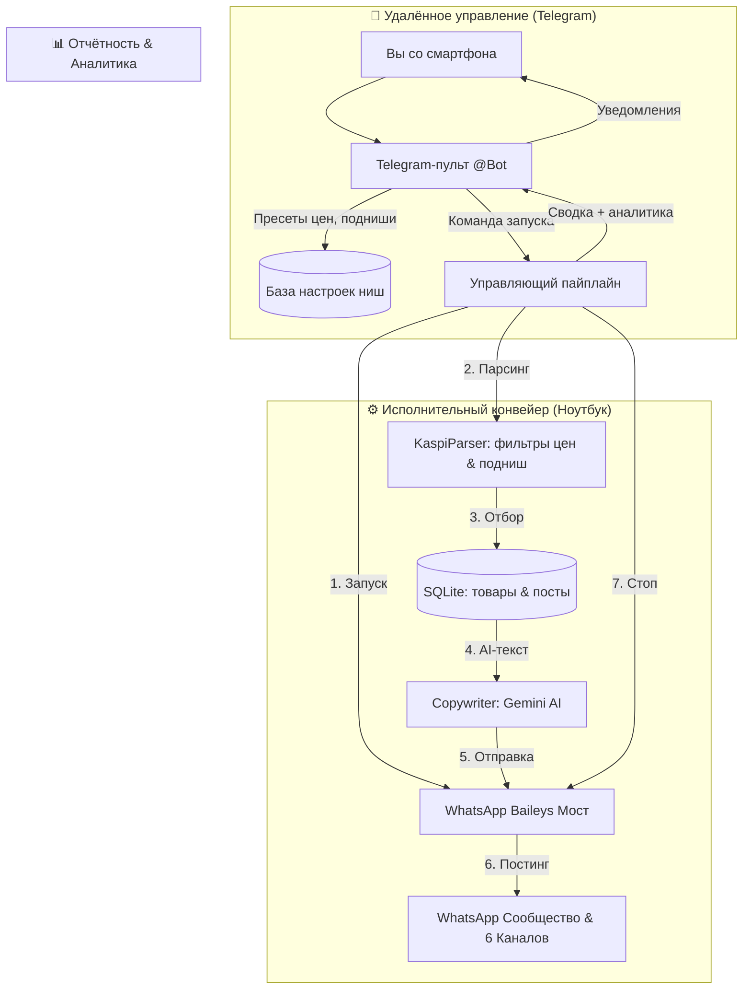

<div align="center">

# 🛒 Kaspi to WhatsApp Community & Social Media Pipeline

**Автономный комплекс для поиска выгодных находок на Kaspi.kz, AI-копирайтинга, публикации в WhatsApp Сообщества и удалённого интерактивного управления через Telegram-бота.**

[](https://python.org)
[](https://nodejs.org)
[](https://github.com/WhiskeySockets/Baileys)
[](https://t.me/BotFather)
[](https://aistudio.google.com)
[](https://sqlite.org)
[](LICENSE)

[📖 Полное руководство](HOW_TO_USE.md) • [📊 Google Таблицы API](SHEETS_API_INSTRUCTIONS.md) • [📐 Архитектура воронки](kaspi_whatsapp_marketplace_blueprint.md)

</div>

---

## 💡 О проекте

**Kaspi Pipeline** — это модульная система автоматизации контента для e-commerce в Казахстане. 

Система сканирует маркетплейс **Kaspi.kz**, отбирает товары по заданным ценовым диапазонам и критериям качества (рейтинг $\ge 4.7$, отзывы $\ge 15$), пишет конверсионные тексты через нейросеть Google Gemini, брендирует фото и отправляет их в нишевые каналы **WhatsApp Сообщества** через локальный мост Baileys.

Управление проектом полностью переведено в **интерактивного Telegram-бота**: вы можете находиться где угодно со смартфоном, в то время как ноутбук выполняет задачи по вашим командам без фоновой траты ресурсов.



---

## 🌟 Ключевые возможности

- 📱 **Удалённый пульт в Telegram (Zero-typing интерфейс)**:
  - Практически все действия выполняются нажатием **inline-кнопок** без клавиатуры.
  - Быстрый выбор диапазонов цен готовыми кнопками (`до 3 000 ₸`, `до 5 000 ₸`, `до 12 000 ₸`, `до 25 000 ₸` и т.д.).
  - Выбор минимального рейтинга (`⭐ 4.5+` .. `⭐ 4.9+`) и числа отзывов (`5+` .. `100+`).
  - **«🎯 Задать направление (поднишу)»**: единственный режим текстового ввода. Вы печатаете поисковый фокус (например: `беспроводные петлички`, `органайзер в багажник`, `оверсайз худи`), и бот переключает алгоритм отбора на этот товар.
- ⚡ **Разовый автоцикл «Старт ➔ Постинг ➔ Стоп»**:
  - Нажали одну кнопку в Telegram — бот поднял локальный WhatsApp-шлюз на ноутбуке, спарсил свежие товары, опубликовал по 1 карточке во все каналы, прислал финансово-статистический отчёт и **автоматически выключил сервер**, освободив оперативную память.
- 🔍 **Умный парсинг Kaspi.kz**:
  - Прямой поиск через API выдачи Kaspi.
  - Антидубликат: товары, которые уже есть в базе, никогда не парсятся повторно.
  - Тонкая фильтрация: отсечка накруток, проверка реальных отзывов, проверка наличия изображений в оригинальном разрешении CDN.
- ✍️ **AI-копирайтинг (Google Gemini)**:
  - Генерация цепляющих постов со структурой: хук-заголовок, 3–4 пользы буллетами, старая и новая цена со скидкой, ссылка на покупку и призыв к действию.
- 📲 **Бесплатный локальный WhatsApp шлюз (Baileys Node.js)**:
  - Работает локально через эмуляцию веб-сессии без платных сторонних API (типа GreenAPI/Twilio).
  - Брендирование картинок: на каждое фото накладывается круглая эмблема Kaspi в высоком разрешении.
  - Zero-Trash Policy: все временные изображения мгновенно удаляются сразу после отправки.
- 📊 **Краткая аналитика и отчёты**:
  - Отчёт в Telegram о каждой отправленной карточке с кликабельной ссылкой на товар.
  - Сводка сессии: сколько отправлено, средний чек, средний рейтинг, остаток буфера по каждой нише (`🟢` достаточно, `🟡` мало, `🔴` пусто).

---

## 📌 Поддерживаемые ниши

В системе настроены 6 популярных товарных категорий:

| Ниша (Slug) | Название | Лимит цены по умолчанию | Примеры товаров |
| :--- | :--- | :--- | :--- |
| `men_clothing` | **Мужская одежда** | до 15 000 ₸ | худи, футболки, брюки, куртки, обувь |
| `gadgets` | **Гаджеты и техника** | до 12 000 ₸ | наушники, повербанки, смарт-часы, кабели |
| `kitchen` | **Кухня и уют** | до 8 000 ₸ | органайзеры, дозаторы, посуда, формы |
| `care` | **Красота и уход** | до 10 000 ₸ | сыворотки, патчи, корейский уход, кремы |
| `auto` | **Автотовары** | до 12 000 ₸ | компрессоры, пылесосы, держатели, органайзеры |
| `sport` | **Спорт и фитнес** | до 10 000 ₸ | резинки, шейкеры, инвентарь для тренировок |

---

## 🚀 Как пользоваться удалённо через Telegram

### 1. Подготовка ноутбука перед уходом
1. Ноутбук должен быть включён и подключён к интернету.
2. Чтобы ноутбук не засыпал при закрытии крышки:
   - Нажмите `Win + R` $\to$ введите `control powercfg.cpl` $\to$ нажмите Enter.
   - Слева выберите **«Действие при закрытии крышки»**.
   - Для пункта *«От сети»* выберите **«Действие не требуется»**.
3. Запустите бота двойным кликом по файлу:
   ```text
   run_bot.bat
   ```
   *(или в терминале: `python main.py bot`)*.
4. Окно консоли остаётся открытым — теперь ноутбук слушает ваши команды из любой точки мира.

---

### 2. Главное меню в Telegram-боте

Откройте диалог с вашим ботом **[@Brifcdbot](https://t.me/Brifcdbot)** (или отправьте `/start` / `/menu`). Перед вами интерактивное меню:

```text
🎛 Центр управления Kaspi Automation
━━━━━━━━━━━━━━━━━━━
[⚡ Запустить цикл (Старт ➔ Постинг ➔ Стоп)]
[🟢 Поднять сервер]        [🔴 Выключить сервер]
[⚙️ Настройки ниш и цен]
[🔍 Спарсить товары сейчас]
[📊 Краткая аналитика]
[🚀 Отправить по 1 товару в WhatsApp]
```

### 3. Сценарии работы кнопками

#### Сценарий А. Быстрый постинг в 1 клик
1. Нажимаете **`⚡ Запустить цикл (Старт ➔ Постинг ➔ Стоп)`**.
2. Бот пишет: *«Запуск разового цикла...»*.
3. Поднимается WhatsApp-мост, отбираются товары, отправляются в группы.
4. Вам в Telegram приходит отчёт по каждому товару и сводная аналитика.
5. Сервер выключается, память ноутбука освобождается.

#### Сценарий Б. Смена диапазона цен для ниши (Zero-Typing)
1. Нажимаете **`⚙️ Настройки ниш и цен`** $\to$ выбираете нишу (например, `📱 Гаджеты и аксессуары`).
2. Нажимаете **`💰 Макс. цена`** $\to$ нажимаете кнопку с нужной ценой: `[8 000 ₸]`, `[12 000 ₸]`, `[20 000 ₸]`.
3. Бот мгновенно сохраняет лимит в базу. При следующем парсинге товары дороже этого лимита не попадут в ленту.
4. Аналогично кнопками настраивается **Мин. цена**, **Рейтинг** (`⭐ 4.8+`) и **Количество отзывов** (`25+`).

#### Сценарий В. Фокусный поиск конкретного товара (Подниша)
1. Заходите в нужную нишу $\to$ нажимаете **`🎯 Задать направление (поднишу)`**.
2. Бот переходит в режим ожидания текста и просит ввести запрос.
3. Вы печатаете: `беспроводные петлички type-c` (или `органайзер в багажник`).
4. Бот подтверждает установку фокуса.
5. Нажимаете **`🔍 Спарсить эту нишу сейчас`** $\to$ бот находит именно эти товары и присылает карточки с кнопками:
   - `[✅ Опубликовать в WhatsApp]` — мгновенная публикация товара в канал.
   - `[❌ Пропустить]` — снятие товара с очереди.
6. Когда фокус больше не нужен, нажмите **`🧹 Сбросить поднишу`** для возврата к общему поиску категории.

#### Сценарий Г. Запрос текущей аналитики
- Нажимаете **`📊 Краткая аналитика`** $\to$ бот присылает:
  - Всего товаров в базе.
  - Сколько опубликовано сегодня и за всё время.
  - Средний чек и диапазон цен.
  - Наполненность очереди по 6 нишам с индикаторами (`🟢` $\ge 4$ шт., `🟡` $\ge 2$ шт., `🔴` пустой буфер).

---

## 🛠️ Установка и первичная настройка

### 1. Клонирование репозитория
```bash
git clone https://github.com/nur667-7/Kaspi.git
cd Kaspi
```

### 2. Установка зависимостей
```bash
# Python библиотеки
pip install -r requirements.txt

# Node.js модуль WhatsApp шлюза
cd wa_bridge && npm install && cd ..
```

### 3. Настройка файла .env
Скопируйте пример:
```powershell
copy .env.example .env
```
Заполните обязательные параметры:
```env
# Telegram Bot (получить у @BotFather)
TELEGRAM_BOT_TOKEN=ваш_токен_бота
TELEGRAM_CHAT_ID=ваш_личный_chat_id

# Google Gemini API (опционально, для AI-описаний)
GEMINI_API_KEY=

# Chat ID групп WhatsApp (куда слать посты)
WA_CHAT_DEFAULT=120363xxxxxx@g.us
WA_CHAT_MEN_CLOTHING=120363xxxxxx@g.us
WA_CHAT_GADGETS=120363xxxxxx@g.us
WA_CHAT_KITCHEN=120363xxxxxx@g.us
WA_CHAT_CARE=120363xxxxxx@g.us
WA_CHAT_AUTO=120363xxxxxx@g.us
WA_CHAT_SPORT=120363xxxxxx@g.us
```

### 4. Авторизация WhatsApp (один раз)
Запустите шлюз в терминале:
```bash
cd wa_bridge
npm start
```
Отсканируйте появившийся в консоли **QR-код** в приложении WhatsApp на телефоне (*Связанные устройства $\to$ Привязка устройства*). Сессия сохранится локально в папке `auth_info_baileys/`. После этого закройте терминал.

---

## 📋 Консольные команды (CLI)

```bash
# Запуск Telegram-пульта управления
python main.py bot

# Проверка связи с Telegram-ботом
python main.py test-tg

# Отправка текущей аналитики в Telegram
python main.py tg-analytics

# Ручной парсинг ниши
python main.py parse --niche gadgets --limit 5

# Генерация AI-описаний
python main.py generate --niche kitchen --limit 3

# Отправка постов в WhatsApp из консоли
python main.py post-wa --niche auto --limit 1

# Генерация слайдов карусели 9:16 для TikTok / Reels
python main.py build-slides --niche men_clothing --count 4

# Выгрузка всех ссылок в Google Таблицу
python main.py sync-sheets
```

---

## 📁 Структура проекта

```text
Kaspi/
├── .env                          # Локальные ключи и Chat ID (в .gitignore, не публикуется)
├── .env.example                  # Образец конфигурационного файла
├── .gitignore                    # Исключения Git (базы, логи, сессии WhatsApp)
├── requirements.txt              # Зависимости Python (Pillow)
├── README.md                     # Главная документация проекта (вы здесь)
├── HOW_TO_USE.md                 # Расширенное руководство
├── SHEETS_API_INSTRUCTIONS.md    # Инструкция по Google Таблицам
├── kaspi_whatsapp_marketplace_blueprint.md # Маркетинговый чертеж сообщества
│
├── telegram_bot.py               # Интерактивный Telegram-пульт (inline-кнопки, подниши, сервер)
├── telegram_notifier.py          # Модуль отправки отчётов и аналитики в Telegram
├── main.py                       # Главный CLI-диспетчер команд
├── config.py                     # Конфигурация, метаданные ниш, описания
├── kaspi_parser.py               # Парсер каталога Kaspi.kz с фильтрами цен и направлений
├── copywriter.py                 # Генератор продающих текстов (Gemini AI / Шаблоны)
├── storage.py                    # SQLite база данных (товары, посты, настройки ниш)
├── daily_runner.py               # Модуль полного цикла и управления процессами моста
├── slide_builder.py              # Рендерер слайдов 9:16 и коллажей 4-в-1 (Pillow)
├── social_exporter.py            # Экспорт медиа-пакетов в Google Drive
├── google_sheets_sync.py         # Синхронизация с Google Таблицами
├── sheets_client.py              # Чтение базы из Google Таблиц
│
├── run_bot.bat                   # Быстрый запуск Telegram-пульта в 1 клик
├── run_daily.bat                 # Пакетный запуск пайплайна
├── run_hidden.vbs                # Фоновый VBS-лаунчер
├── setup_scheduler.bat           # Установщик расписания Windows (при необходимости)
├── remove_scheduler.bat          # Скрипт отключения расписания Windows
│
├── kaspi_avatar.png              # Брендовая графика Kaspi для вотермарок и аватарок
├── kaspi_emblem.svg
├── kaspi_logo.svg
│
└── wa_bridge/                    # Node.js микросервис (WhatsApp Baileys Bridge)
    ├── package.json              # Зависимости (@whiskeysockets/baileys, express)
    ├── server.js                 # HTTP API (отправка медиа, создание групп, /shutdown)
    ├── migrate_whatsapp_full.js  # Скрипт создания каналов и сообщества
    └── update_descriptions.js    # Массовая установка описаний групп
```

---

## 🛡️ Безопасность и Anti-Ban

1. **Защита номеров участников**: Использование архитектуры **WhatsApp Community** гарантирует, что обычные участники не видят телефонные номера друг друга, что исключает спам и взаимные жалобы.
2. **Паузы между сообщениями**: При публикации соблюдается интервал в 2.5–3 секунды для предотвращения срабатывания спам-фильтров WhatsApp.
3. **Безопасность репозитория**: В файл `.gitignore` строго внесены локальные базы данных (`kaspi_media.db`), конфигурации с ключами (`.env`), авторизационные сессии WhatsApp (`auth_info_baileys`), логи и временные медиафайлы. Ваши ключи и токены никогда не попадут в открытый доступ.
4. **Защита Telegram-бота**: Бот принимает команды и реагирует на нажатия кнопок **только от вашего личного `TELEGRAM_CHAT_ID`**. Посторонние пользователи не смогут управлять системой.

---

## 📄 Лицензия

Проект распространяется под свободной лицензией **MIT**. Подробности в файле `LICENSE`.
