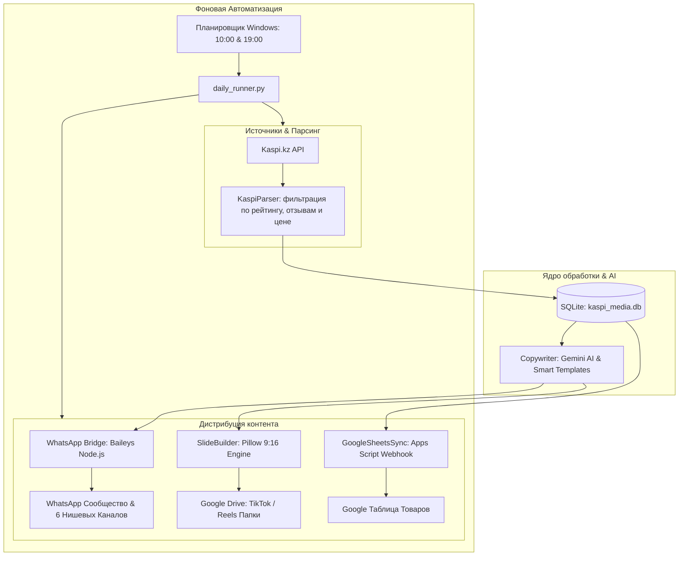

<div align="center">

# 🛒 Kaspi to WhatsApp Community & Social Media Pipeline

**Автономный конвейер для поиска выгодных находок на Kaspi.kz, AI-копирайтинга, автопостинга в WhatsApp Сообщества и сборки виральных каруселей для TikTok / Instagram Reels.**

[](https://python.org)
[](https://nodejs.org)
[](https://github.com/WhiskeySockets/Baileys)
[](https://aistudio.google.com)
[](https://sqlite.org)
[](https://microsoft.com)
[](LICENSE)

[📖 Полное руководство пользователя](HOW_TO_USE.md) • [📊 Google Таблицы API](SHEETS_API_INSTRUCTIONS.md) • [📐 Архитектурный план и воронка](kaspi_whatsapp_marketplace_blueprint.md)

</div>

---

## 💡 О проекте

**Kaspi Pipeline** — это модульный программный комплекс для построения автоматизированной медиа-воронки и e-commerce сообществ в Казахстане. 

Система ежедневно сканирует каталог крупнейшего маркетплейса **Kaspi.kz**, отбирает товары с высоким рейтингом ($\ge 4.7$) и проверенными отзывами, генерирует продающие описания с помощью нейросетей, публикует их в закрытые каналы **WhatsApp Community** через бесплатный локальный шлюз и верстает готовые дизайн-пакеты вертикальных слайдов (9:16) для публикации в **TikTok** и **Instagram**.



---

## 🌟 Ключевые возможности

- 🔍 **Умный парсинг Kaspi.kz**: Поиск товаров по семантическим ключевым словам в 6 нишах, автоматическая отсечка низкокачественных товаров (фильтр: рейтинг $\ge 4.7$, отзывы $\ge 15$, лимит бюджета).
- ✍️ **AI-копирайтинг (Google Gemini)**: Создание цепляющих постов с крючками внимания, списком практических преимуществ, ценой со скидкой и призывами к действию (с умным fallback на локальные шаблоны).
- 📲 **Бесплатный WhatsApp-шлюз (Baileys)**: Полноценное управление WhatsApp Web через локальный Node.js сервер. Отправка фото с подписями, создание Сообществ и подгрупп, автонастройка описаний чатов.
- 🎨 **Генератор каруселей 9:16 (Slide Builder)**: Автоматическая верстка брендированных графических слайдов (1080x1920 px) для соцсетей:
  - `01_Обложка.png` — продающая заглавная карточка.
  - `02..05_Товар.png` — карточки товаров с фото, рейтингом и ценовым бейджем.
  - `06_Коллаж_Сетка.png` — виральный слайд 2х2 со всеми товарами выпуска.
  - `07_CTA.png` — финальный слайд воронки с призывом подписаться.
  - `Сценарий_и_хештеги.txt` — готовый текст с виральными тегами для ролика.
- ☁️ **Двусторонняя синхронизация**:
  - **Google Sheets**: автосинхронизация базы товаров через Apps Script Webhook для интеграции с внешними ботами и CRM.
  - **Google Drive**: мгновенный экспорт медиа-пакетов в локальную или облачную папку Google Drive for Desktop.
- ⏰ **Фоновая автономность 24/7**: Готовые bat-скрипты и VBS-обертки для бесшумного запуска по расписанию через Планировщик задач Windows без мигающих консольных окон.

---

## 📌 Поддерживаемые ниши

В системе преднастроены 6 наиболее конверсионных товарных категорий:

| Ниша (Slug) | Название | Лимит цены | Ключевые слова | Канал WhatsApp |
| :--- | :--- | :--- | :--- | :--- |
| `men_clothing` | **Мужская одежда** | до 15 000 ₸ | футболка, худи, брюки, куртка | Канал: Мужская одежда |
| `gadgets` | **Гаджеты и техника** | до 10 000 ₸ | повербанк, наушники, кабель, подставка | Канал: Гаджеты и аксессуары |
| `kitchen` | **Кухня и уют** | до 8 000 ₸ | органайзер, дозатор, овощерезка, формы | Канал: Кухня и уют |
| `care` | **Красота и уход** | до 7 000 ₸ | патчи, сыворотка, крем, массажер | Канал: Уход и красота |
| `auto` | **Автотовары** | до 8 000 ₸ | держатель, компрессор, органайзер, ароматизатор | Канал: Автотовары |
| `sport` | **Спорт и фитнес** | до 10 000 ₸ | фитнес-резинки, шейкер, эспандер, коврик | Канал: Спорт и фитнес |

---

## ⚡ Быстрый старт за 5 минут

### 1. Клонирование и установка зависимостей
```bash
# Клонируйте проект
git clone https://github.com/ВАШ_АККАУНТ/Kaspi.git
cd Kaspi

# Установите Python-библиотеки
pip install -r requirements.txt

# Установите Node.js зависимости для WhatsApp шлюза
cd wa_bridge && npm install && cd ..
```

### 2. Настройка конфигурации
Скопируйте шаблон `.env.example` в `.env`:
```powershell
copy .env.example .env
```
Заполните базовые параметры (API-ключ Gemini, путь к Google Диску при необходимости).

### 3. Запуск WhatsApp шлюза и привязка телефона
В отдельном терминале запустите шлюз:
```bash
cd wa_bridge
npm start
```
Отсканируйте появившийся в консоли **QR-код** через WhatsApp на смартфоне (*Настройки $\to$ Связанные устройства $\to$ Привязка устройства*).

### 4. Создание сообщества и привязка каналов
```bash
# Автоматически создать сообщество и 6 подгрупп
python main.py create-community

# Посмотреть полученные ID чатов и внести их в .env
python main.py list-chats

# Применить конверсионные описания к каналам
python main.py set-descriptions
```

### 5. Запуск первой публикации или сквозного цикла
```bash
# Сквозной цикл по всем нишам: парсинг -> AI-тексты -> WhatsApp -> TikTok слайды
python main.py pipeline --niche all --limit 3
```

> 📘 **Подробное пошаговое руководство со всеми нюансами доступно в [HOW_TO_USE.md](HOW_TO_USE.md)**.

---

## 📋 Основные консольные команды (CLI)

```bash
# Просмотр статуса базы и соединения с WhatsApp
python main.py status

# Список поддерживаемых ниш
python main.py list-niches

# Парсинг товаров по нише
python main.py parse --niche kitchen --limit 5

# Генерация продающих AI-описаний
python main.py generate --niche gadgets --limit 3

# Публикация готовых постов в WhatsApp
python main.py post-wa --niche auto --limit 1

# Генерация TikTok/Reels слайдов (9:16)
python main.py build-slides --niche men_clothing --count 4

# Запуск Telegram-бота управления (кнопки, диапазоны цен, модерация)
python main.py bot

# Проверка связи с Telegram-ботом
python main.py test-tg

# Отправка текущей аналитики каталога и очереди в Telegram
python main.py tg-analytics

# Автономный пайплайн в 1 команду
python main.py pipeline --niche all --limit 4
```

---

## 📁 Структура проекта

```text
Kaspi/
├── .env.example                  # Шаблон переменных окружения
├── .gitignore                    # Исключения Git (ключи, сессии, базы данных, кэш)
├── requirements.txt              # Зависимости Python (Pillow)
├── README.md                     # Главная страница репозитория (вы здесь)
├── HOW_TO_USE.md                 # Полное руководство пользователя от А до Я
├── SHEETS_API_INSTRUCTIONS.md    # Спецификация и инструкция по Google Таблицам
├── kaspi_whatsapp_marketplace_blueprint.md # Архитектурный и маркетинговый чертеж
│
├── main.py                       # Главный CLI интерфейс командной строки
├── config.py                     # Конфигурация, ниши, ценовые пороги, параметры
├── kaspi_parser.py               # Модуль парсинга каталога Kaspi.kz с фильтрами цен
├── copywriter.py                 # Генератор продающих текстов (Gemini AI / Шаблоны)
├── telegram_notifier.py          # Модуль отчетов и сводной аналитики в Telegram
├── telegram_bot.py               # Интерактивный Telegram-пульт управления (кнопки, пресеты цен, модерация)
├── slide_builder.py              # Рендерер вертикальных слайдов 9:16 (Pillow)
├── social_exporter.py            # Менеджер структурированного экспорта в Google Drive
├── storage.py                    # SQLite хранилище товаров, истории и кастомных настроек ниш
├── google_sheets_sync.py         # Модуль синхронизации с Google Таблицами
├── sheets_client.py              # Клиент для чтения данных из Google Таблиц
├── daily_runner.py               # Автономный раннер ежедневных утренних и вечерних запусков
│
├── run_bot.bat                   # Быстрый запуск Telegram-пульта управления
├── setup_scheduler.bat           # Установка задач в Планировщик Windows (10:00 и 19:00)
├── remove_scheduler.bat          # Удаление задач из Планировщика Windows
├── run_daily.bat                 # Пакетный скрипт запуска пайплайна
├── run_hidden.vbs                # Бесшумный VBS-лаунчер без всплывающих окон консоли
│
├── kaspi_avatar.png              # Графические ассеты бренда для оформления слайдов
├── kaspi_emblem.svg
├── kaspi_logo.svg
│
└── wa_bridge/                    # Локальный Node.js WhatsApp шлюз
    ├── package.json              # Зависимости (@whiskeysockets/baileys, express)
    ├── server.js                 # HTTP API сервер для взаимодействия с Python
    ├── migrate_whatsapp_full.js  # Скрипт миграции и создания сообществ
    └── update_descriptions.js    # Скрипт массового обновления описаний чатов
```

---

## ⚙️ Переменные окружения (.env)

| Переменная | Обязательна | Назначение | Пример / По умолчанию |
| :--- | :---: | :--- | :--- |
| `GEMINI_API_KEY` | Нет | Ключ Google Gemini API для AI копирайтера | `AIzaSy...` |
| `WA_BRIDGE_HOST` | Да | Хост локального WhatsApp шлюза | `127.0.0.1` |
| `WA_BRIDGE_PORT` | Да | Порт локального WhatsApp шлюза | `3000` |
| `WA_COMMUNITY_ID` | Да | ID WhatsApp Сообщества | `120363xxxxxx@g.us` |
| `WA_COMMUNITY_ANNOUNCEMENT` | Да | ID главной группы объявлений Сообщества | `120363xxxxxx@g.us` |
| `WA_CHAT_DEFAULT` | Да | Чат объявлений по умолчанию | `120363xxxxxx@g.us` |
| `WA_CHAT_<NICHE>` | Да | Индивидуальные чаты объявлений для 6 ниш | `120363xxxxxx@g.us` |
| `KASPI_CITY_ID` | Нет | Код города Kaspi (750000000 = Алматы) | `750000000` |
| `MIN_RATING` | Нет | Минимальный рейтинг товара | `4.7` |
| `MIN_REVIEWS` | Нет | Минимальное число отзывов покупателей | `15` |
| `GOOGLE_SHEETS_WEBHOOK_URL`| Нет | URL вебхука Google Apps Script | `https://script.google.com/...` |
| `GOOGLE_DRIVE_PATH` | Нет | Путь к папке Google Drive for Desktop | `G:\Мой диск\Kaspi_Находки` |

---

## 🛡️ Безопасность и Anti-Ban

1. **Защита номеров участников**: Использование архитектуры **WhatsApp Community** гарантирует, что обычные участники не видят телефонные номера друг друга, что исключает спам и жалобы на спам.
2. **Добровольные подписки**: Аудитория переходит исключительно по официальным ссылкам-приглашениям (`chat.whatsapp.com/...`). Прямой инвайтинг номеров вручную запрещен алгоритмами Meta.
3. **Безопасность репозитория**: В файл `.gitignore` строго внесены локальные базы данных (`kaspi_media.db`), конфигурации с ключами (`.env`), авторизационные сессии WhatsApp (`auth_info_baileys`), логи и сгенерированный контент.

---

## 🛠️ Стек технологий

- **Языки**: Python 3.10+, JavaScript (Node.js 18+)
- **WhatsApp Web Engine**: [@whiskeysockets/baileys](https://github.com/WhiskeySockets/Baileys), Express
- **AI & NLP**: Google Gemini 1.5 Flash API
- **Графический движок**: Python Pillow (PIL)
- **База данных**: SQLite3
- **Интеграции**: Google Sheets API (Google Apps Script), Google Drive Desktop
- **Системное окружение**: Windows Task Scheduler, VBScript, Batch

---

## 📄 Лицензия

Проект распространяется под свободной лицензией **MIT**. Подробности в файле `LICENSE`.
