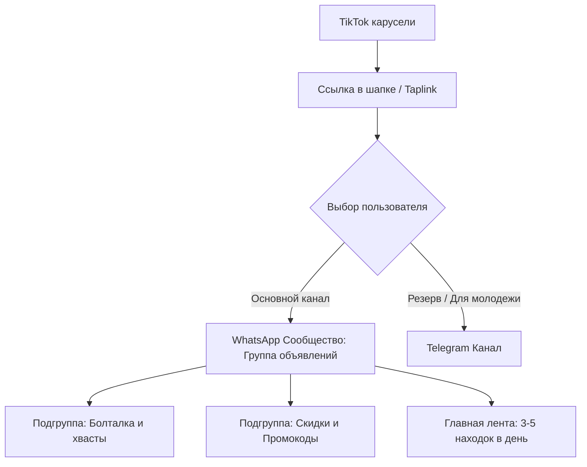
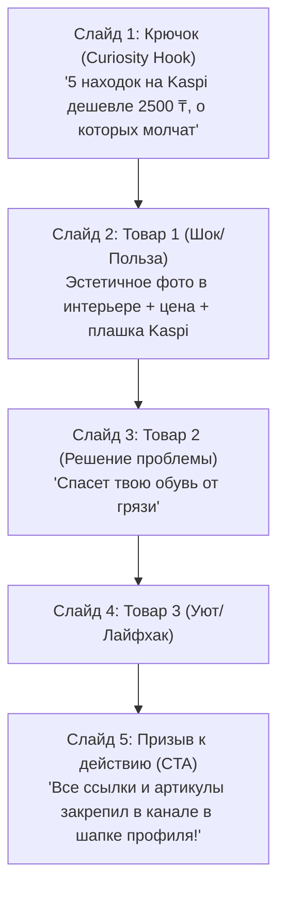
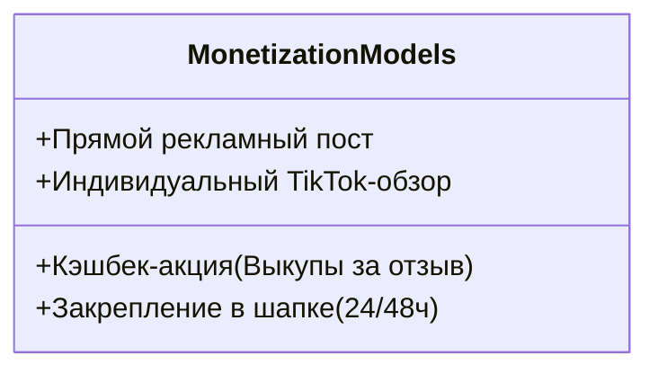

# Архитектура проекта: Канал находок Kaspi в WhatsApp + ТТ-воронка

Комплексный архитектурный план и операционная стратегия запуска медиа-проекта «Находки с Kaspi / маркетплейсов» с трафик-воронкой через TikTok-карусели, автоматизацией поиска товаров и моделью монетизации на селлерах.

---

## 1. Слой 1: Экосистема WhatsApp в Казахстане

WhatsApp в Казахстане имеет проникновение свыше 90% среди платежеспособного населения (включая регионы и аудиторию 25–55 лет). Однако у WhatsApp есть жесткие алгоритмы защиты от спама и специфика форматов.

### Сравнение форматов в WhatsApp

| Формат | Плюсы | Минусы / Риски | Применимость для проекта |
| :--- | :--- | :--- | :--- |
| **Обычная группа (до 1024 чел.)** | Сообщения приходят в основной список чатов; высокий Open Rate (до 70–80%). | **Критический риск**: номера всех участников видны всем. Спамеры парсят базу, участники жалуются, Meta банит номер создателя навсегда. | ❌ Не рекомендуется как основной канал |
| **WhatsApp Channels (Каналы)** | Номера подписчиков и админа скрыты. Неограниченное число подписчиков. Формат один-ко-многим. | Находятся во вкладке «Актуальное» (Updates), а не во входящих чатах. Нет комментариев (только реакции). Ниже Open Rate (~20–35%). | ⚠️ Хорош как долгосрочный безопасный актив |
| **WhatsApp Community (Сообщество)** | **Идеальный гибрид**: создается «Группа объявлений» (Announcement Group). **Номера участников скрыты** от чужих глаз (видны только админу). Чат находится в основном списке. Лимит до 2000–5000 участников. | Требует аккуратного администрирования. При переполнении нужно создавать Сообщество №2, №3. |  **Рекомендуемый формат для старта** |

### Динамика набора аудитории и виральность в WhatsApp
1. **Прямой шеринг («Скинь подруге / маме»)**: WhatsApp — главный мессенджер для пересылки («forwarding»). Если товар вызывает эмоцию «Ого, всего 990 ₸ на Kaspi», домохозяйки и студенты форвардят карточку в семейные и рабочие чаты.
2. **Безопасность номера (Anti-Ban стратегия)**:
   > [!WARNING]
   > Никогда не добавляйте людей по номерам вручную! Это гарантированный бан аккаунта WhatsApp за 24–48 часов. Переход должен быть **строго добровольным** по инвайт-ссылке (`chat.whatsapp.com/...`).
3. **Прогрев аккаунта**: аккаунт администратора должен быть зарегистрирован на официальный WhatsApp Business, привязан к физической SIM-карте (не виртуальной), существовать не менее 1–2 месяцев и иметь реальную переписку.

---

## 2. Слой 2: Автоматизация, Скиллы, API и MCP для поиска товаров

У Kaspi.kz нет публичной партнерской программы (CPA/Affiliate), как у AliExpress или Amazon. Поэтому стратегия строится на парсинге трендов, перепаковке контента и интеграции данных.

### Архитектура технического конвейера

```mermaid
flowchart LR
    subgraph Sources [Источники Находок]
        K_Parser[Kaspi API / JSON Parser]
        WB_Ozon[Wildberries / 1688 Хиты продаж]
        Pinterest[Эстетичные фото / Pinterest]
    end

    subgraph Core [AI & Data Processing]
        Filter[Фильтр: Рейтинг >=4.7, Цена <= 5000₸]
        LLM[LLM / AI Рерайтер: Зацепка + Эмоция]
        CardGen[Генератор Карточек / Slide Builder]
    end

    subgraph Distribution [Дистрибуция]
        TG_Bot[Telegram Poster Bot]
        WA_Gate[WhatsApp API Gateway: Green-API / Whapi]
        TT_Pack[Пакет слайдов для TikTok]
    end

    Sources --> Core
    Core --> Distribution
```

### 1. Источники данных и API
* **Kaspi Internal JSON API**:
  Kaspi в мобильном приложении и вебе использует открытые внутренние JSON-эндпоинты (каталог, поиск, отзывы):
  - Каталог и фильтры: `https://kaspi.kz/yml/product-view/data/products/...`
  - Поиск с сортировкой по скидкам/популярности.
  - Из карточки парсятся: название, текущая цена, старая цена (акция/Kaspi Red), рейтинг, количество отзывов, фото товара и ID продавца.
* **Арбитраж контента с 1688 / Taobao / WB**:
  90% товаров в категории «Товары для дома / уют / гаджеты» на Kaspi завезены с Китая или Wildberries. 
  - Находка ищется в трендах WB / Douyin (китайский TikTok).
  - По названию или фото находится аналог на Kaspi.
  - Фото из отзывов на WB/1688 используются для визуала (они живые и вызывают больше доверия, чем белые каталожные фото Kaspi).

### 2. Стек автоматизации и MCP (Model Context Protocol)
Для создания собственной AI-фабрики контента создается связка:
* **Kaspi Finder MCP Server**: локальный микросервис, предоставляющий инструменты:
  - `search_kaspi_deals(category, max_price, min_rating)`
  - `get_product_details(kaspi_url)` — парсит характеристики и реальные отзывы.
* **Post Formatter Skill / Script**:
  - Принимает сырые данные товара.
  - Генерирует лаконичный продающий пост: Заголовок-крючок, реальная польза (2-3 буллета), цена со значком ₸, ссылка на Kaspi и артикул.
* **Шлюз для WhatsApp**:
  - Для автоматической публикации в WhatsApp сообщество используется **Green-API** или **Whapi.cloud** (стабильные шлюзы на базе протокола WhatsApp Web) либо ручная публикация за 2 минуты в день.

---

## 3. Слой 3: Воронка трафика из TikTok (Карусели)

TikTok в 2025–2026 годах активно отдает органические показы фото-каруселям со звуком. Алгоритм задерживает пользователей на пролистывании, что дает высокий Retention Rate.

### Анатомия вирусной карусели находок

### Правила обхода цензуры TikTok
> [!IMPORTANT]
> TikTok жестко пессимизирует ролики, если в описании или на слайде писать слова: *«WhatsApp», «Ватсап», «Ватсапп», «Инстаграм», «Переходите по ссылке»*.
> 
> **Как оформлять:**
> - На последнем слайде: иконка зеленого мессенджера или нейтральный текст: *«Прямые ссылки на Kaspi в описании профиля»* или *«Канал в био 🔗»*.
> - В шапке профиля: мультиссылка (Taplink / mssg.me / собственный микролендинг), где крупная кнопка: **«Группа находок Kaspi (WhatsApp)»** и резервная **«Telegram-канал»**.

### Конверсионная воронка
* 1 вирусная карусель (50 000 просмотров в KZ):
  * Переходы в профиль: ~1 500 – 2 500 (3-5%).
  * Клики по ссылке в шапке: ~600 – 1 000.
  * Вступления в WhatsApp Community: ~350 – 600 подписчиков с одного залетевшего ролика.

---

## 4. Монетизация: Работа с селлерами Kaspi

Селлеры на Kaspi испытывают огромную боль: **карточки без продаж и отзывов не поднимаются в топ органического поиска Kaspi**.

### Почему селлеры будут платить администратору?
1. **Самовыкупы и первые отзывы**: Селлерам нужны реальные покупатели, которые купят товар, заберут из постамата/доставки и напишут отзыв с 5 звездами.
2. **Внешний трафик (External Boost)**: Kaspi ранжирует карточки выше, если видит резкий приток уникальных переходов и добавлений в корзину/избранное.
3. **Ликвидация остатков**: когда селлеру нужно срочно освободить склад или распродать партию перед завозом нового сезона.

### Тарифная сетка для селлеров

1. **Базовый рекламный пост**:
   - Публикация карточки селлера в WhatsApp + Telegram с его ссылкой.
   - Стоимость на старте (при базе 1 000–3 000 участников): 3 000 – 7 000 ₸ за пост.
2. **Формат «Кэшбек за отзыв» (Самый маржинальный)**:
   - Селлер оплачивает админу комиссию + выделяет бюджет на кэшбек (например, товар стоит 2 000 ₸, селлер возвращает 1 000 ₸ покупателю за фотоотзыв).
   - Подписчики обожают этот формат, так как получают товар с 50-70% скидкой, а селлер получает отзывы и рейтинг.
3. **Пакет «TikTok + WhatsApp комбо»**:
   - Товар селлера включается 2-м или 3-м слайдом в TikTok-карусель, а в WhatsApp размещается прямая ссылка.
   - Прайс: 15 000 – 35 000 ₸.

---

## 5. Пошаговый план реализации (Roadmap)

### Этап 1: Ручной MVP и упаковка (Дни 1–4)
* Создать сообщество WhatsApp («Kaspi Находки / Скидки KZ»).
* Настроить профиль: описание, правила, аватарку.
* Оформить Taplink со ссылкой-приглашением.
* Заготовить первые 15–20 качественных находок вручную (товары для кухни, авто, органайзеры, трендовая косметика).

### Этап 2: Запуск TikTok-воронки (Дни 5–14)
* Создать аккаунт TikTok с геопривязкой к Казахстану.
* Публиковать по 2–3 карусели в день (шаблоны в Canva / Figma).
* Использовать трендовые звуки и хештеги: `#kaspi`, `#каспинаходки`, `#обзортоваров`, `#алматы`, `#астана`.

### Этап 3: Подключение автоматизации и инструментов (Недели 3–4)
* Разработка парсера трендов Kaspi (Python + BeautifulSoup/Playwright или API-скрипт).
* Подключение шлюза WhatsApp для автопостинга или полуавтоматического постинга через Telegram-бота админки.
* Подготовка коммерческого предложения (медиакита) для селлеров.

### Этап 4: Выход на селлеров и монетизация (Месяц 2)
* Поиск селлеров в чатах Kaspi-продавцов (в Telegram десятки сообществ: «Kaspi Селлеры», «Товарка Казахстан»).
* Предложение тестовых интеграций со скидкой 50% первым 5 клиентам за кейс и отзыв.
